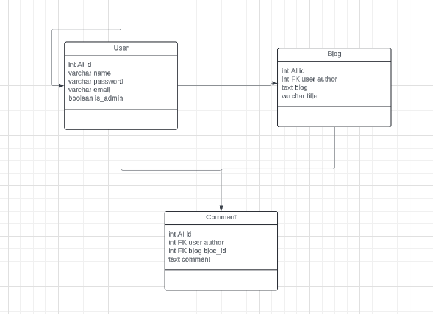

# Blog_Application

# About App
Simple Blog Application with user authentication.

# Tech stack:
  - Nest Js
  - Next JS
  - Prisma for ORM
  - MySQL

# ERD

# Setup

1. clone repo **git@github.com:LennardUy104/Blog_Application.git**
2. cd Blog_Application
3. cd BE
4. npm install
5. npm run start:dev

# EndPoints

### Auth

- /api/register, POST
- /api/login, POST
- /api/logout, POST
- /api/user, GET

### User

- /api/user/users, GET
- /api/user/users/:id, GET
- /api/user/users/:id, PUT
- /api/user/users/:id, DELETE

### Blogs

- /api/blog, GET
- /api/blog, POST
- /api/blog/:id, GET
- /api/blog/:id, PATCH
- /api/blog/:id, DELETE

### Comments

- /api/comments, GET
- /api/comments, POST
- /api/comments/:id, GET
- /api/comments/:id, PATCH
- /api/comments/:id, DELETE
